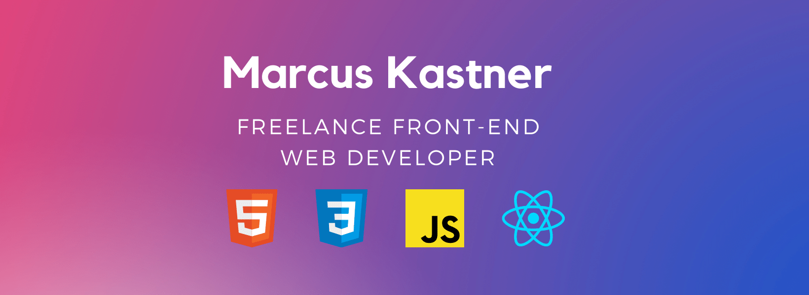

## Table of contents
* [About Me](#about-me)
* [Technologies](#technologies)
* [What I'm Working On](#what-im-working-on)

## About Me
My name is Marcus and I am currently a freelance Front End Web Developer.

I am making a transition from teaching chemistry and am seeking fulltime employment.

After teaching myself the fundamental of HTML, CSS and Javascript I moved on to building sites with Gatsby on the front end and pulling data from Sanity on the backend. I have also developed a react native app and used Firebase for user authentication services. 

## Technologies

* HTML
* CSS
* Javascript   
* React
* REST API
* Graphql
* State Context
* Gatsby
* Sanity
* Bootstrap
* Stripe
* React Native

## What I'm Working On
Currently I am working on learning three.js, blender and other 3d tech.

